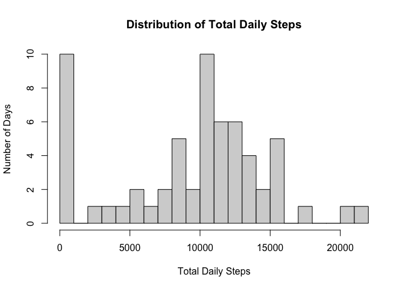
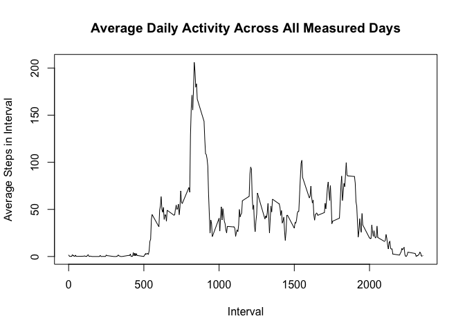
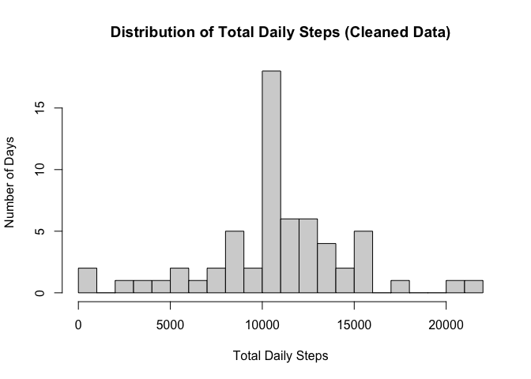
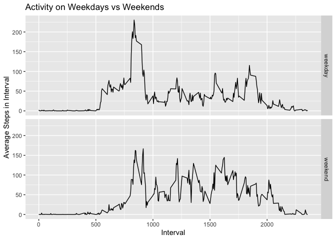

## Loading and Preprocessing Data

First, we load used libraries.

```r
library(ggplot2)
library(dplyr)
```

```
## 
## Attaching package: 'dplyr'
```

```
## The following objects are masked from 'package:stats':
## 
##     filter, lag
```

```
## The following objects are masked from 'package:base':
## 
##     intersect, setdiff, setequal, union
```

We will extract activity.zip and load the data from the csv to a data frame.

```r
if(file.exists("activity.csv")) {
    df <- read.csv("activity.csv")
} else if(file.exists("activity.zip")) {
    unzip("activity.zip")
    df <- read.csv("activity.csv")
} else {
    stop("Please name activity data as 'activity.csv' or 'activity.zip' 
         and move the file into this directory.")
}
```

Assuming no error, let's take a peek at the structure of the data.

```r
str(df)
```

```
## 'data.frame':	17568 obs. of  3 variables:
##  $ steps   : int  NA NA NA NA NA NA NA NA NA NA ...
##  $ date    : chr  "2012-10-01" "2012-10-01" "2012-10-01" "2012-10-01" ...
##  $ interval: int  0 5 10 15 20 25 30 35 40 45 ...
```

```r
summary(df)
```

```
##      steps            date              interval     
##  Min.   :  0.00   Length:17568       Min.   :   0.0  
##  1st Qu.:  0.00   Class :character   1st Qu.: 588.8  
##  Median :  0.00   Mode  :character   Median :1177.5  
##  Mean   : 37.38                      Mean   :1177.5  
##  3rd Qu.: 12.00                      3rd Qu.:1766.2  
##  Max.   :806.00                      Max.   :2355.0  
##  NA's   :2304
```

We immediately realize that the data is in the correct format, but has class character, so we will change it over to a Date.

```r
df <- transform(df, date=as.Date(date))
str(df)
```

```
## 'data.frame':	17568 obs. of  3 variables:
##  $ steps   : int  NA NA NA NA NA NA NA NA NA NA ...
##  $ date    : Date, format: "2012-10-01" "2012-10-01" ...
##  $ interval: int  0 5 10 15 20 25 30 35 40 45 ...
```

There also seem to be many NA's in the steps column, but we will keep them for now to analyze them a bit later.

## What is mean total number of steps taken per day?

First, let's look at the data and answer the question: How many steps are taken each day?

```r
daily_steps <- df %>% 
    group_by(date) %>% 
    summarize(tsteps=sum(steps, na.rm = TRUE))
hist(daily_steps$tsteps, breaks=20,
     xlab="Total Daily Steps", ylab="Number of Days", main="Distribution of Total Daily Steps")
```

<!-- -->

Now, we will find the mean and median values of total number of steps taken per day (over all days recorded). We will first make a data frame with daily total steps, and then find these values.

```r
m <- mean(daily_steps$tsteps)
md <- median(daily_steps$tsteps)
data.frame(
    Mean = m, 
    Median = md, 
    row.names = "Statistics")
```

```
##               Mean Median
## Statistics 9354.23  10395
```

So the **mean** total steps per day was found to be **9354.2295082 steps/day**, and the **median** was found to be **10395 steps/day**.

## What is the average daily activity pattern?

The plot below shows the average daily activity for every 5-minute interval across the recorded days.


```r
avg_daily_activity <- df %>% 
    group_by(interval) %>% 
    summarize(msteps=mean(steps, na.rm=TRUE))
plot(avg_daily_activity$interval, avg_daily_activity$msteps, type="l",
     xlab="Interval", ylab="Average Steps in Interval", main="Average Daily Activity Across All Measured Days")
```

<!-- -->

We can easily find the 5-min interval that had the most activity (highest average steps) across all the recorded days. 

```r
maxinterval <- (avg_daily_activity %>%
    arrange(desc(msteps)) %>%
    head(1))$interval
```

So the interval with the highest average number of steps is **835**.

## Imputing missing values

To find the total number of NAs in our dataset, we can look at the number of NAs in each column

```r
apply(is.na(df),2,sum)
```

```
##    steps     date interval 
##     2304        0        0
```

```r
total_na <- sum(is.na(df))
```
So there are only missing values in the steps column, and there are a total of **2304 missing values**.  
  
We want to fill in these missing values, so we will attempt to fill these in by taking looking at the interval for the missing value, and inputting the mean activity for that interval over all the days (calculated in the last section). Let's do that now and make a new dataset out of it.


```r
clean_df<-df
for(x in 1:nrow(clean_df)){
    if(is.na(clean_df[x,"steps"])){
        interval <- clean_df[x,"interval"]
        clean_df[x,"steps"] <- avg_daily_activity$msteps[which(avg_daily_activity$interval==interval)]
    }
}
sum(is.na(clean_df))
```

```
## [1] 0
```
So our clean_df dataset should now contain no NA values, instead substituting the mean steps for any interval with NA steps.  
  
Re-doing our part one analysis with our cleaned data:

```r
clean_daily_steps <- clean_df %>% 
    group_by(date) %>% 
    summarize(tsteps=sum(steps))
hist(clean_daily_steps$tsteps, breaks=20,
     xlab="Total Daily Steps", ylab="Number of Days", 
     main="Distribution of Total Daily Steps (Cleaned Data)")
```

<!-- -->

We see that the histogram has clearly changed, showing no daily bars at 0 steps (although one is almost invisible) since we've filled in step counts for each NA value.  
  
Now, finding the mean and median values of total number of steps taken per day for the clean data:

```r
clean_m <- mean(clean_daily_steps$tsteps)
clean_md <- median(clean_daily_steps$tsteps)
data.frame(
    Mean = clean_m, 
    Median = clean_md, 
    row.names = "Statistics")
```

```
##                Mean   Median
## Statistics 10766.19 10766.19
```

The mean and median have both increased, and we see that **mean = median = 1.0766189\times 10^{4} steps**. The mean makes sense because the daily total steps mean is now the sum of the means across intervals for a single day, and we have imputed values so as to preserve this quantity. The median ends up being the same by virtue of having at least 1 total step value that is exactly equal to the mean (potentially, a full day that was previously entirely NA in the steps column), and this value being near the middle of the overall distribution of daily step measurements. An interesting, coincidental artifact of our process!

## Are there differences in activity patterns between weekdays and weekends?
Using our new filled-in data set, we will look at activity differences between weekdays and weekends. To do this, we add a column in the data frame that tells us whether the day is a weekday or weekend.

```r
date_to_day_type <- function(date){
    weekend <- c("Saturday", "Sunday")
    if(weekdays(date) %in% weekend) {
        return("weekend")
    } else {
        return("weekday")
    }
}
clean_df$day_type <- sapply(clean_df$date,date_to_day_type)
clean_df <- transform(clean_df, day_type=as.factor(day_type))
```

Now that we've added the new day_type column, let's group over it and process/visualize the data once again, taking the mean steps per interval over all relevant days in that day_type.

```r
avg_day_type_activity <- clean_df %>% 
    group_by(day_type, interval) %>% 
    summarize(msteps=mean(steps))
```

```
## `summarise()` has grouped output by 'day_type'. You can override using the
## `.groups` argument.
```

```r
ggplot(avg_day_type_activity, aes(interval, msteps)) +
    geom_line() +
    facet_grid(rows = vars(day_type)) +
    labs(x = "Interval", y= "Average Steps in Interval", title="Activity on Weekdays vs Weekends")
```

<!-- -->

There do seem to be some differences in the data, especially the spike in activity on weekday mornings, followed by much lower activity in the afternoons and evenings on weekdays. Meanwhile, weekend activity appears much more consistent over the intervals, on average.
